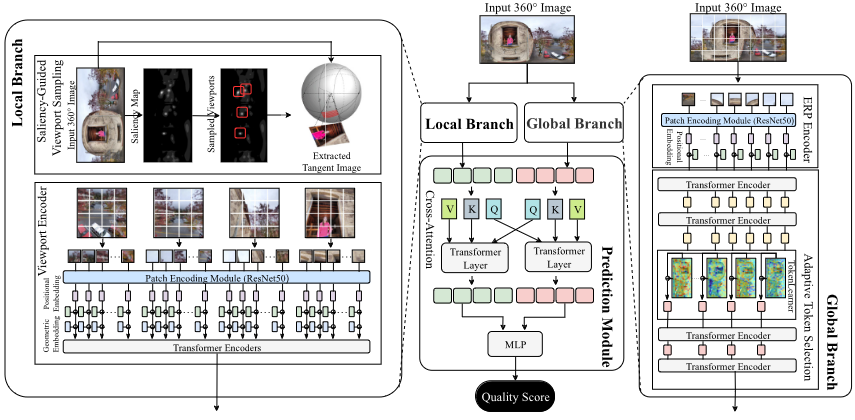

  
  

    The paper addresses the challenge of quality assessment for 360-degree images by introducing LGT360IQ, a dual-branch framework that effectively combines local and global information for improved accuracy. Their extensive evaluation on multiple datasets highlights the framework's superior performance compared to traditional methods.
  

